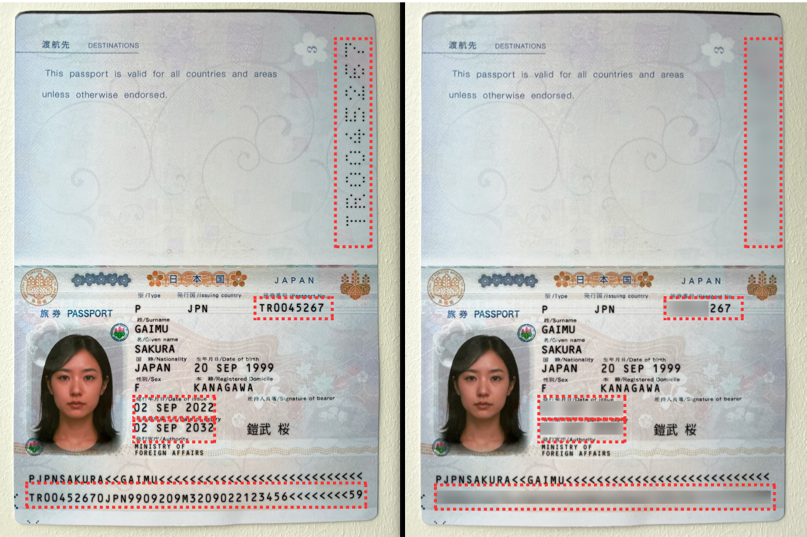
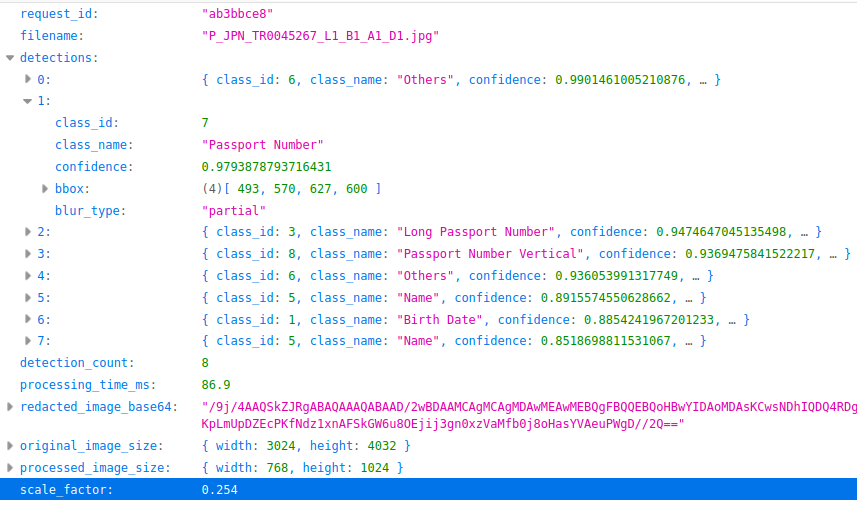

# Redact ID  
**Production-ready document redaction API for sensitive IDs and personal data**

 


RedactID is a **FastAPI + YOLO** service that automatically detects and redacts sensitive information (IDs, passport numbers, addresses) from document images — designed for **real-world compliance workflows**, not demos.

> Built as a clean MVP to showcase production-grade AI engineering: async processing, configurable redaction rules, and audit-ready outputs.


## Why RedactID

Most redaction tools are either:
- ❌ manual
- ❌ opaque
- ❌ impossible to audit

**RedactID solves this by design.**

- 🔒 Privacy-first redaction logic  
- ⚡ Fast async inference  
- 🧠 Configurable partial vs full blur  
- 📊 Audit-friendly JSON metadata  
- 🚀 Drop-in API for existing systems  

---

## Key Capabilities

- YOLO-based PII detection (IDs, passports, addresses)
- Smart redaction policies
  - Full blur for sensitive fields
  - Partial blur (keep last digits visible) when allowed
- Two clean endpoints
  - `/redact` → image output
  - `/redact/json` → image + metadata
- Single-pass inference (YOLO runs once per request)
- Production safeguards
  - File size limits
  - Dimension limits
  - Structured logging
- Async, non-blocking design

---

## Redaction Logic (What Makes This Useful)

### Supported Classes (example)

| Field | Policy |
|------|-------|
| Address | Full blur |
| Long Passport Number | Full blur |
| ID Number | Partial or full |
| NHI ID | Partial or full |
| Passport Number | Partial or full |

### Partial Blur Strategy

Partial blur keeps the **rightmost portion visible** (e.g. last 3–4 digits):

██████████6789


This enables:
- Human verification
- Compliance checks
- Customer support workflows

### Partial Modes

- **`best` (default)**  
  Only the highest-confidence ID field keeps partial visibility  
  → ideal for single-document images

- **`all`**  
  All ID fields get partial blur  
  → useful when multiple documents appear in one image

---

## API Overview

### 1️⃣ Redact Image (binary output)

```bash
curl -X POST "http://localhost:8000/redact?partial_mode=best&keep_ratio=0.3" \
  -F "file=@document.jpg" \
  --output redacted.jpg
```

Response headers include:
- Request ID
- Processing time
- Detection count
- Applied redaction mode

### 2️⃣ Redact with Metadata (JSON)

```bash
curl -X POST "http://localhost:8000/redact/json" \
  -F "file=@document.jpg"
```

Returns:
- Base64 redacted image
- Detected fields
- Confidence scores
- Blur type per field
- Original vs processed dimensions

Perfect for:
- Audit trails
- Compliance logs
- Downstream automation

### Example JSON Output (trimmed)

```json
{
  "request_id": "a3b7c9d2",
  "detection_count": 2,
  "processing_time_ms": 214.8,
  "detections": [
    {
      "class_name": "ID Number",
      "confidence": 0.95,
      "blur_type": "partial"
    },
    {
      "class_name": "Address",
      "confidence": 0.88,
      "blur_type": "full"
    }
  ]
}
```

---

## Performance

Typical latency for a 1024×768 image:
- YOLO inference: ~150–200 ms
- Redaction + encoding: ~30–40 ms
- **Total: ~200–250 ms**

Optimized via:
- One inference per request
- Async background execution
- Auto-resizing safeguards

---

## Quick Start

```bash
# Install dependencies
uv sync

# Set model path
export MODEL_PATH=path/to/best.pt

# Run server
uv run python -m src.redact_id.main
```

Open interactive docs: [http://localhost:8000/docs](http://localhost:8000/docs)

---

## Deployment-Ready

- ✅ Stateless API
- ✅ Docker-friendly
- ✅ Environment-driven configuration
- ✅ Clean separation of core logic and API layer

---

## What This Project Demonstrates

- Production-grade FastAPI design
- Async execution with CPU offloading
- Real PII redaction logic (not toy blurring)
- Clean architecture boundaries
- Client-ready API surface

---

## Project Status

✅ **MVP complete**
🚧 **Easy to extend:**
- OCR integration
- PDF support
- Policy per jurisdiction
- Role-based redaction rules

---

## License

MIT (or client-specific licensing)