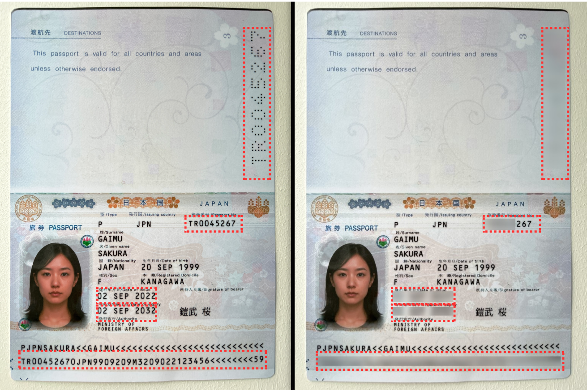
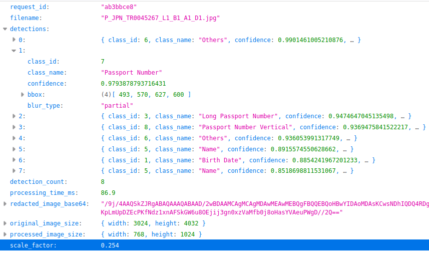

# RedactID - document redaction API for IDs and sensitive personal data

RedactID is an API-first service that detects sensitive fields in document images and returns a safely redacted result.

It is built for teams that need a practical way to process ID cards, passports, and similar documents without exposing full personal data during review, storage, or downstream handling.

This repository is the backend service only. It does not include a Streamlit or React frontend.

## Sample Output




## Why This Project

Many document-handling workflows still depend on manual redaction, inconsistent review steps, or tools that are difficult to integrate into an existing system.

RedactID provides a cleaner alternative:

- detect sensitive fields automatically
- apply full or partial masking based on policy
- return a redacted image through a simple API
- expose metadata that supports review and auditing

## What It Solves

RedactID helps organizations reduce the friction of handling identity documents and personal records in digital workflows.

It can be used to:

- redact uploaded ID and passport images before sharing internally
- reduce exposure of full document numbers during review
- support compliance and audit workflows with structured metadata
- connect redaction into existing portals, admin tools, or case systems

## Who It's For

- operations teams handling customer or citizen documents
- compliance and privacy-focused workflows
- internal platforms that need document masking before storage or review
- teams building API-based document processing services

## What You Can Do

- send an image to the API and receive a redacted JPEG
- request a JSON response with the redacted image and detection metadata
- choose between full redaction and controlled partial visibility for ID-like fields
- tune confidence threshold, visible ratio, and JPEG quality per request
- override the default redaction policy with your own policy file

## Key Features

- YOLO-based document field detection
- full blur for mandatory classes
- partial blur for selected ID-like classes when policy allows it
- audit-friendly JSON metadata with detected fields and blur type
- request headers for request ID, latency, and detection count
- upload guardrails for file size and image dimensions
- async FastAPI service design for non-blocking request handling

## Redaction Behavior

The service is designed for document-related classes such as:

- Address
- ID Number
- NHI ID
- Passport Number
- Long Passport Number

### Partial Blur Strategy

For eligible ID-like fields, RedactID can blur the left side of the field while keeping the rightmost portion visible.

Example:

```text
XXXXXXXXXX6789
```

This is useful when teams need to confirm they are looking at the right document without exposing the full value.

### Partial Modes

- `best`  
  Only the highest-confidence ID-like detection keeps partial visibility. Other eligible detections are fully blurred.

- `all`  
  All eligible ID-like detections keep partial visibility.

## API at a Glance

Available endpoints:

- `GET /` - health check
- `POST /redact` - returns a redacted JPEG
- `POST /redact/json` - returns a JSON payload with a base64 redacted image and metadata

`POST /redact` response headers include:

- `X-Request-ID`
- `X-Processing-Time-Ms`
- `X-Detections-Count`
- `X-Partial-Mode`

## Quickstart with Docker Compose

Prerequisites:

- Docker
- Docker Compose
- a YOLO weights file for this project

### Prepare the required files

```bash
# 1. Create the Docker env file
cp .env.docker.example .env.docker

# 2. Make sure the Compose policy file exists at
#    policy/redaction_policy.json
#
# 3. Place your trained model weights here
#    model/trained_model.pt
```

### Start the API

```bash
docker compose up --build
```

Access:

- API: `http://localhost:8000`
- API docs: `http://localhost:8000/docs`

Notes:

- The current Compose setup starts a single service: `app`
- Compose mounts `./model` to `/model`
- Compose mounts `./policy` to `/policy`
- The container uses `MODEL_PATH=/model/trained_model.pt`
- The container uses `REDACTION_POLICY_PATH=/policy/redaction_policy.json`
- The current Compose image tag is `aminook/redact-id:0.2.0`

Stop the service with:

```bash
docker compose down
```

## Example API Usage

### Redact an image and download the result

```bash
curl -X POST "http://localhost:8000/redact?partial_mode=best&keep_ratio=0.3" \
  -F "file=@document.jpg" \
  --output redacted.jpg
```

### Redact an image and return JSON metadata

```bash
curl -X POST "http://localhost:8000/redact/json" \
  -F "file=@document.jpg"
```

Example response shape:

```json
{
  "request_id": "a3b7c9d2",
  "filename": "document.jpg",
  "detection_count": 2,
  "processing_time_ms": 214.8,
  "detections": [
    {
      "class_id": 2,
      "class_name": "ID Number",
      "confidence": 0.95,
      "bbox": [10, 10, 100, 40],
      "blur_type": "partial"
    },
    {
      "class_id": 0,
      "class_name": "Address",
      "confidence": 0.88,
      "bbox": [20, 50, 180, 120],
      "blur_type": "full"
    }
  ],
  "redacted_image_base64": "..."
}
```

## Configuration

Key environment variables:

| Variable | Description | Default |
|---|---|---|
| `MODEL_PATH` | Path to the YOLO weights file | Required |
| `REDACTION_POLICY_PATH` | Optional path to a redaction policy JSON file | `None` |
| `MAX_FILE_SIZE` | Maximum upload size in bytes | `5242880` |
| `MAX_IMAGE_DIMENSION` | Resize guardrail for large images | `1024` |
| `KEEP_RATIO` | How much of the right side stays visible for partial blur | `0.3` in `.env.docker.example` |
| `BLUR_KERNEL` | Optional fixed blur kernel size | `None` |
| `BLUR_STRENGTH` | Multiplier used for automatic blur kernel selection | `5` |
| `HOST` | Host binding when running the app directly | `0.0.0.0` |
| `PORT` | Port when running the app directly | `8000` |
| `RELOAD` | Auto-reload for local runs | `1` |

## Local Development

```bash
cp .env.example .env
uv sync --dev
```

Make sure your local `.env` points to a valid model file, then run:

```bash
uv run uvicorn redact_id.api:create_app --factory --host 127.0.0.1 --port 8000 --reload
```

Local URLs:

- API: `http://localhost:8000`
- API docs: `http://localhost:8000/docs`

Run tests:

```bash
uv run pytest
```

## Extending the Service

Common next steps for client deployments:

- customer-specific redaction policies
- OCR-based post-processing and validation
- PDF input support
- authentication and rate limiting
- integration into existing web or back-office systems
